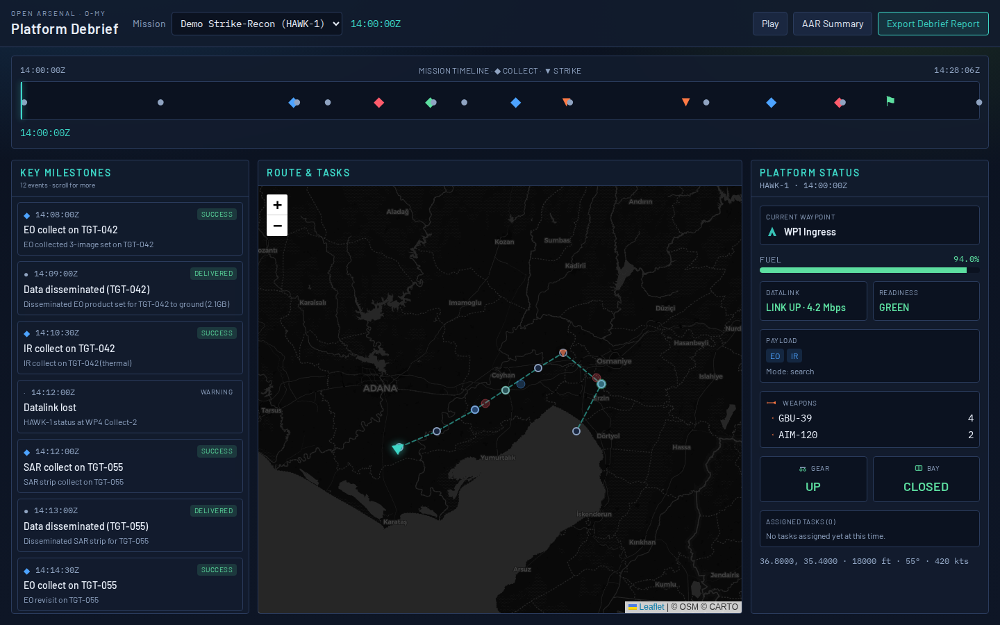
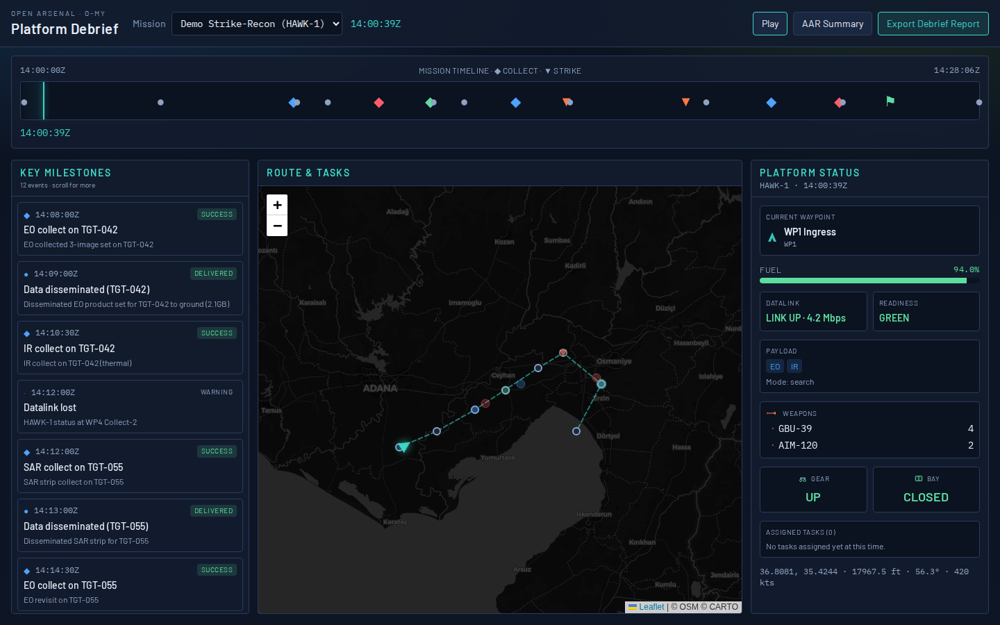
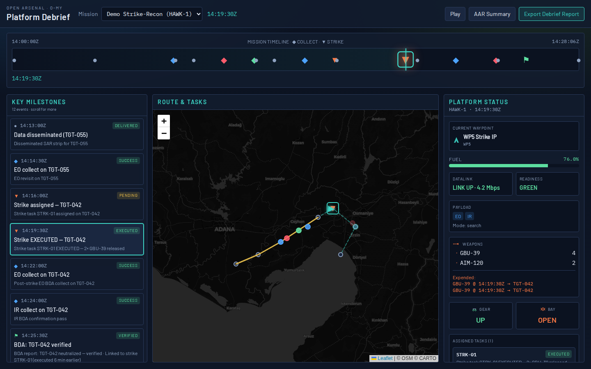
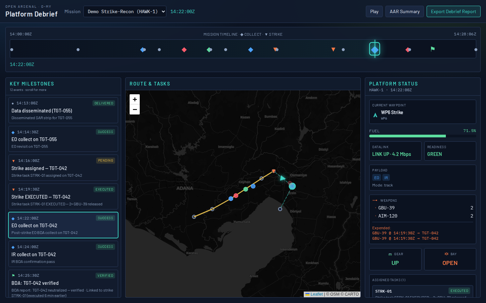
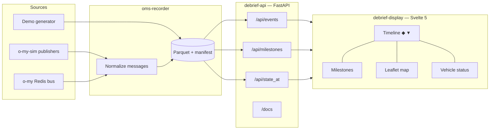
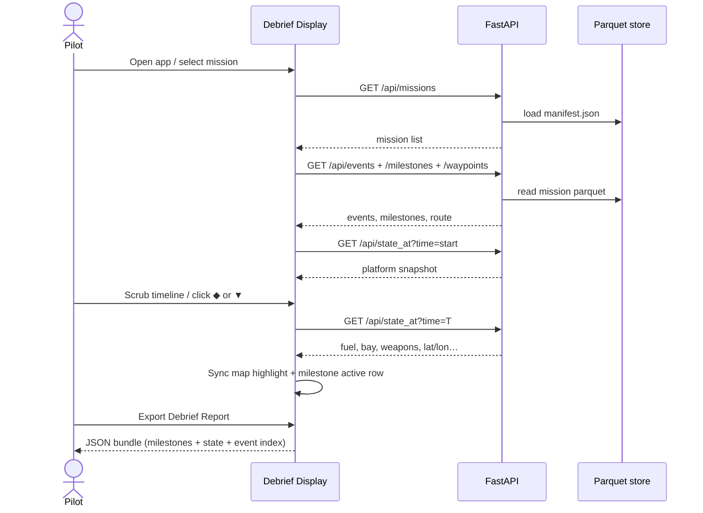

# o-my Platform Debrief

**Platform Debrief capability for the Open Arsenal o-my OMS ecosystem.**

Captures live or simulated OMS bus messages from o-my Redis topics, persists them to Parquet, exposes time/milestone queries via FastAPI + Swagger, and renders a Svelte debrief station with:

- Interactive timeline — **◆** sensor collects, **▼** strike tasks, **⚑** BDA
- Stacked key milestones (left) — scrollable; selection highlights timeline event
- Route / task map (center) — strike points as down carets
- Vehicle status at scrub time — waypoint, assigned tasks, fuel, datalink, payload, weapons / gear / bay icons

---

## Status

**Runnable MVP on this branch.** Demo mission works without Redis or o-my running.

| Capability | Status |
|------------|--------|
| OpenSpec + Gherkin acceptance scenarios | Shipped |
| Beads epic + phased issues (`omd-h3a`) | Shipped |
| Demo mission generator → Parquet + manifest | Shipped |
| Recorder (demo / JSONL / Redis + OMS XML) | Shipped |
| FastAPI query API + Swagger | Shipped |
| YAML milestone classifier + BDA linkage | Shipped |
| Track samples + interpolated `/api/position_at` | Shipped |
| Rule-based AAR `/api/summary` | Shipped |
| Svelte display (timeline, milestones, map, status, export) | Shipped |
| Unit tests (`make test`) | Shipped (12) |
| Screenshots | Shipped (`docs/screenshots/`) |

Living spec: [`openspec/specs/o-my-debrief/spec.md`](openspec/specs/o-my-debrief/spec.md) · Gherkin: [`features/o-my-debrief.feature`](features/o-my-debrief.feature) · Beads: [`BEADS.md`](BEADS.md) · Grok notes: [`docs/GROK-TASKS.md`](docs/GROK-TASKS.md) · Classifier design: [`docs/MILESTONE-CLASSIFIER.md`](docs/MILESTONE-CLASSIFIER.md) · o-my-sim: [`docs/OMY-SIM-INTEGRATION.md`](docs/OMY-SIM-INTEGRATION.md)

GitHub issues (mirrored from beads): [#2](https://github.com/mowgli42/o-my-debrief/issues/2) [#3](https://github.com/mowgli42/o-my-debrief/issues/3) [#4](https://github.com/mowgli42/o-my-debrief/issues/4) [#5](https://github.com/mowgli42/o-my-debrief/issues/5)

---

## Quick start

```bash
python3 -m venv .venv
source .venv/bin/activate
pip install -e ".[test]"
make fixtures

# Terminal 1 — API on :8020 (/docs Swagger)
make backend

# Terminal 2 — UI on :5173
cd frontend && npm install && npm run dev
```

Open **http://127.0.0.1:5173**

1. Mission **Demo Strike-Recon (HAWK-1)** loads automatically  
2. Scrub the timeline or hit **Play**  
3. Click a milestone (e.g. Strike EXECUTED) — map + vehicle panel sync  
4. **Export Debrief Report** downloads a JSON after-action bundle  

API smoke:

```bash
curl -s http://127.0.0.1:8020/api/health
curl -s 'http://127.0.0.1:8020/api/milestones?mission=msn-demo-strike-recon' | head -c 400
make test
```

Docker: `docker compose up` (API :8020, UI :5173). Live Redis profile: `docker compose --profile live up`.

---

## Screenshots









Refresh captures (API + Vite running):

```bash
make capture
# or: DEMO_URL=http://127.0.0.1:5173 cd frontend && node ../scripts/capture-screenshots.mjs
```

---

## Architecture



| Layer | Implementation |
|-------|----------------|
| Recorder | Python — demo / JSONL / Redis → pyarrow Parquet |
| Store | `omy_debrief.store` — time filters, milestone rules, state-at |
| API | FastAPI + Pydantic, CORS, OpenAPI at `/docs` |
| UI | Svelte 5 runes, Vite, Tailwind 4, Leaflet (CARTO dark tiles) |
| Tracking | Beads (`bd`, prefix `omd`) + OpenSpec + Gherkin |

### Development sequence (OpenSpec)

Per [`openspec/WORKFLOW.md`](openspec/WORKFLOW.md):

1. **Specify** — capability in `openspec/specs/` (+ change folders for deltas)  
2. **Beads** — epic + phase children linked with `--spec-id`  
3. **Implement** — demo/contracts → recorder & API → display → docs/tests  
4. **Validate** — `make test`, Swagger, UI scrub, `make capture`  
5. **Archive** — merge change deltas into living specs  

---

## Sequence — debrief scrub



---

## Repo map

```text
openspec/                 WORKFLOW, project context, living spec
features/                 Gherkin acceptance scenarios
src/omy_debrief/
  demo/generate.py        Synthetic strike-recon → Parquet
  recorder/cli.py         demo | jsonl | redis → Parquet
  store.py                Query + milestone extraction + state_at
  api/app.py              FastAPI routes
  models/events.py        Pydantic models
frontend/                 Svelte 5 debrief station
tests/test_api.py         API smoke tests
docs/screenshots/         UI captures
docs/GROK-TASKS.md        Tasks suited for Grok
data/debrief/             Generated parquet (make fixtures)
.beads/                   Issue DB (bd)
```

---

## Recorder modes

```bash
# Regenerate demo mission (default path for UI)
python -m omy_debrief.demo.generate --out data/debrief

# Replay JSONL into a named session
python -m omy_debrief.recorder.cli --mode jsonl \
  --jsonl data/debrief/msn-demo-strike-recon.jsonl \
  --mission replay-1 --out data/debrief

# Live Redis (requires o-my / o-my-sim publishing)
python -m omy_debrief.recorder.cli --mode redis \
  --redis-url redis://127.0.0.1:6379/0 \
  --duration 60 --mission live-1
```

Topics default to UCI bus names aligned with `o-my` (`uci.platform.status`, `uci.task`, `uci.signal.report`, …).

---

## Grok / parallel-agent callouts

These beads are labeled `grok` and left open on purpose — good for design-heavy or cross-repo work:

| Bead | Focus |
|------|--------|
| `omd-h3a.8` | YAML milestone classifier rules + BDA↔strike linkage |
| `omd-h3a.9` | Full track interpolation + map animation polish |
| `omd-h3a.10` | Optional local-LLM after-action narrative |
| `omd-h3a.11` | Live Redis capture fidelity vs o-my-sim publishers |

Details and suggested prompts: **[`docs/GROK-TASKS.md`](docs/GROK-TASKS.md)** · claim with `bd update <id> --claim`.

---

## Related repos

- [`o-my`](https://github.com/mowgli42/o-my) — C2 / UCI bus processors  
- [`o-my-sim`](https://github.com/mowgli42/o-my-sim) — publishers / scenario clock  
- [`fuzzy-reconciler`](https://github.com/mowgli42/fuzzy-reconciler) — OpenSpec + Svelte/FastAPI reference layout  
- `battlespace-manager` — potential display consumer  

---

*Open Arsenal — Open by Design • Agile by Default*
